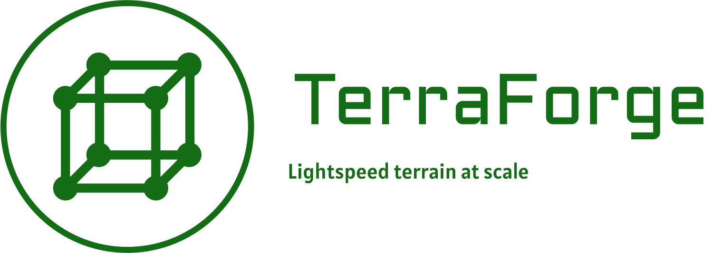

# TerraForge



Welcome to TerraForge, a Rust-based terrain engine designed for high-performance and scalable terrain generation and manipulation. TerraForge leverages advanced algorithms and parallel processing to generate and triangulate vast terrains efficiently.

## Table of Contents!

- [TerraForge](#terraforge)
  - [Table of Contents!](#table-of-contents)
  - [Overview](#overview)
  - [Features](#features)
  - [Installation](#installation)
  - [Usage](#usage)
    - [Triangulation](#triangulation)
    - [Fibonacci Sphere Generation](#fibonacci-sphere-generation)
  - [Contributing](#contributing)
  - [License](#license)

## Overview

TerraForge is built to handle large-scale terrain generation using a Fibonacci sphere algorithm for point distribution and Delaunay triangulation for mesh generation. It is optimized for performance with multi-threaded processing, making it suitable for real-time applications and large datasets.

## Features

- **High Performance**: Utilizes multi-threading and efficient algorithms to ensure quick processing times.
- **Scalable**: Designed to handle large datasets and extensive terrain models.
- **Versatile**: Suitable for various applications, including game development, simulations, and geographic information systems (GIS).

## Installation

To use TerraForge, you need to have [Rust](https://www.rust-lang.org/) installed. You can add TerraForge to your project by including it in your `Cargo.toml` file:

```toml
[dependencies]
spade = "1.9.2" # Add the spade library for Delaunay triangulation
terraforge = { git = "https://github.com/yourusername/terraforge.git" } # Replace with your repo URL
```

## Usage

### Triangulation

TerraForge provides a function to perform Delaunay triangulation on a set of 3D points. The triangulation function projects the points onto a 2D plane for processing.

```rust
use terraforge::perform_triangulation;

fn main() {
    let points = vec![
        (0.0, 0.0, 0.0),
        (1.0, 0.0, 0.0),
        (0.0, 1.0, 0.0),
        (1.0, 1.0, 0.0),
    ];
    
    match perform_triangulation(points) {
        Ok(triangulation) => println!("Triangulation successful!"),
        Err(e) => println!("Error during triangulation: {:?}", e),
    }
}
```

### Fibonacci Sphere Generation

TerraForge includes a function to generate points on a sphere using the Fibonacci lattice method. This is useful for creating evenly distributed points over a spherical surface, ideal for terrain generation on planetary scales.

```rust
use terraforge::generate_fibonacci_sphere;

fn main() {
    let num_samples = 1000;
    let min_latitude = -90.0;
    let max_latitude = 90.0;
    let min_longitude = -180.0;
    let max_longitude = 180.0;
    let seed = 0.5;
    
    match generate_fibonacci_sphere(num_samples, min_latitude, max_latitude, min_longitude, max_longitude, seed) {
        Ok(points) => {
            println!("Generated points:");
            for point in points {
                println!("{:?}", point);
            }
        },
        Err(e) => println!("Error generating points: {:?}", e),
    }
}
```

## Contributing

We welcome contributions to TerraForge! Whether it's reporting bugs, improving documentation, or contributing code, your help is appreciated.

1. Fork the repository.
2. Create a new branch for your feature or bugfix.
3. Commit your changes.
4. Push to your branch.
5. Create a pull request.

Please ensure your code adheres to the existing style and passes all tests.

## License

TerraForge is licensed under the MIT License. See the [LICENSE](LICENSE) file for more details.

---

Thank you for using TerraForge! If you have any questions or feedback, feel free to open an issue on our GitHub repository.


# Spherical Voronoi Diagram Generator

This Rust library generates evenly spaced Voronoi diagrams on a sphere using the Fibonacci spiral method. It's designed to create hexagon-like regions of nearly uniform size across the surface of a sphere, which can be useful for various applications such as planet generation, geographic data analysis, or spherical tessellation.

## Concept

The library uses the following key concepts:

1. **Fibonacci Spiral**: A method for distributing points evenly on a sphere's surface.
2. **Jittering**: Adding small random offsets to points to prevent artifacts from perfectly regular patterns.
3. **Stereographic Projection**: A technique to map points on a sphere to a 2D plane and back.
4. **Delaunay Triangulation**: Used to create the dual graph of the Voronoi diagram.
5. **Spherical Voronoi Diagram**: The final result, showing regions on the sphere where each region contains all points closer to its center than to any other center.

## Implementation

The library is implemented in Rust and uses the following main components:

- `fibonacci_point`: Generates a single point on the Fibonacci spiral.
- `generate_fibonacci_sphere`: Creates a set of points distributed on a sphere using the Fibonacci spiral method.
- `create_spherical_voronoi`: Constructs the Voronoi diagram from the generated points.
- `stereographic_projection` and `inverse_stereographic_projection`: Handle the mapping between 3D spherical coordinates and 2D planar coordinates.
- `calculate_spherical_circumcenter`: Computes the center of a spherical triangle, used for Voronoi cell centers.
- `print_voronoi_edges`: Outputs the Voronoi diagram edges for visualization.

## Usage

To use this library in your Rust project:

1. Add the library to your `Cargo.toml`:

```toml
[dependencies]
spherical_voronoi = { git = "https://github.com/yourusername/spherical_voronoi.git" }
```

2. In your Rust code, import and use the library:

```rust
use spherical_voronoi::{generate_fibonacci_sphere, create_spherical_voronoi, print_voronoi_edges};

fn main() -> std::io::Result<()> {
    let num_samples = 1000;
    let jitter = 0.1;
    let points = generate_fibonacci_sphere(num_samples, jitter)?;
    
    let triangulation = create_spherical_voronoi(points);

    print_voronoi_edges(&triangulation)?;

    println!("Voronoi edges have been written to voronoi_edges.txt");

    Ok(())
}
```

This will generate a set of points on a sphere, create a Voronoi diagram, and write the edges to a file named `voronoi_edges.txt` in a format suitable for visualization in tools such as Unreal Engine.

## Customization

You can adjust the following parameters to customize the output:

- `num_samples`: Increase for more detailed tessellation (more Voronoi cells).
- `jitter`: Adjust between 0.0 and 1.0 to control the randomness of point placement.

## Output

The library generates two files:

- `output.txt`: Contains the list of generated points and the time taken to generate them.
- `voronoi_edges.txt`: Contains the edges of the Voronoi diagram in a format suitable for visualization.

## Dependencies

This library depends on the following Rust crates:

- `spade`: For Delaunay triangulation
- `rand`: For random number generation
- `rayon`: For parallel processing

Ensure these dependencies are included in your `Cargo.toml` file.

```toml
[dependencies]
spade = "1.8.2"
rand = "0.8.5"
rayon = "1.5.1"
```
